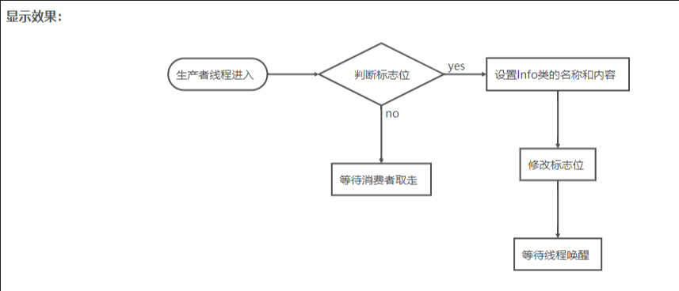

## 熟悉markdown 语法

### 链接 
hello word[文晨科技](http://yaochenyang.xin)


### 有序列表 1.2.3
1.列表内容
2.列表内容
3.列表内容

### 加载http网络图片 

<!-- more -->
### 加载本地图片  


### 无序列表   
- 列表内容
+ 列表内容
* 列表内容

### 代码块    
```  
hello word ycy
```

### 斜体，加粗，删除线  * _ (斜体) ， **(加粗) ， ***（斜体加粗），~~（删除线）

*这是倾斜的文字*
_这是倾斜的文字1_
**这是加粗 ** 
***这是斜体加粗的文字***
~~这是加删除线的文字~~


###   引用
>这是引用的内容


### 分割线  ***， --- ，_ _ _
*** （*号）
--- （减号）
_ _ _ （下划线）

### 表格  （冒号写在左边表示左对齐 ，右边为右对齐，两边都写表示居中）
表头|表头|表头
:-|:-:|  -:
内容|内容|内容
内容|内容|内容

### 流程图

定义元素的语法
>tag=>type: content:>url; 

1.tag 是流程图中的标签，在第二段连接元素时会用到。名称可以任意，一般为流程的英文缩写和数字的组合。
2.type 用来确定标签的类型，=>后面表示类型。由于标签的名称可以任意指定，所以要依赖type来确定标签的类型
标签有6种类型：start end operation condition inputoutput subroutine
3.content 是流程图文本框中的描述内容，: 后面表示内容，中英文均可。特别注意，冒号与文本之间一定要有个空格
4.url是一个连接，与框框中的文本相绑定，:>后面就是对应的 url 链接，点击文本时可以通过链接跳转到 url 指定页面 


1.开始
st=>start: 开始

2.结束

e=>end: 结束

3.操作

op1=>operation: 操作、执行说明


4.条件

cond=>condition: 确认？

5.输入输出

io=>inputoutput: catchsomething...

6.子程序

sub1=>subroutine: My Subroutine

7.URL

e=>点击本结束跳转:>


+使用 -> 来连接两个元素
+对于condition类型，有yes和no两个分支，如示例中的cond(yes)和cond(no)
+每个元素可以制定分支走向，默认向下，也可以用right指向右边，如示例中sub1(right)。

 ```flow
  st=>start: 生产者线程进入 :>www.wenchenkj.com
 op1=>operation: 设置Info类的名称和内容
 op2=>operation: 修改标志位
 op3=>operation: 等待线程唤醒
 op4=>operation: 等待消费者取走
 cond=>condition: 判断标志位

 st(right)->cond->op1->op2->op3
 cond(yes,right)->op1
 cond(no)->op4
 ``` 
 

***上面的流程图使用了URL点击上面的的开始框(生产者线程进入)，就会跳转到我的博客首页www.wenchenkj.com。 
这里再强调一下：每一个元素都可以加上right指明流程流程图的方向，如果不指定的话默认是向下的***